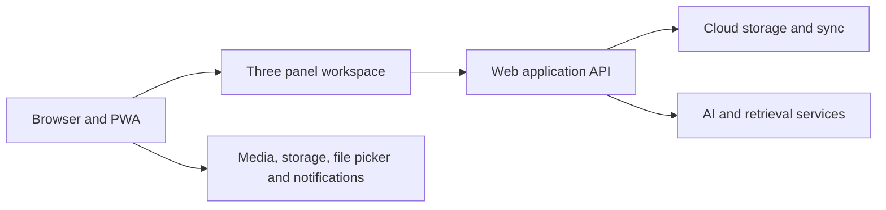

# NoteGen Web Parity Design

Feature Name: notegen-web-parity
Updated: 2026-07-21

## Description

本设计将原版 NoteGen `dev` 分支转换为 GPL-3.0 的浏览器应用。目标是保持原版可见功能、工作流和三栏组件布局，并以 Web 平台能力替代 Tauri 宿主接口。

## Architecture

## Components and Interfaces

| 原版组件域 | Web 组件域 | Web 等价方式 |
|---|---|---|
| `LeftSidebar` 与文件管理器 | 工作区资源栏与文件树 | 云端工作区、File System Access API、上传与下载 |
| `EditorLayout` 与 Markdown 编辑器 | 中央编辑器 | 浏览器编辑器内核、IndexedDB 草稿与后端版本 |
| `Chat` 与 RAG 切换 | 右侧 AI 聊天栏 | 流式 HTTP、授权检索和服务器端模型调用 |
| `mark` 记录中心 | 记录采集与整理模块 | IndexedDB、媒体上传、浏览器剪贴板和 MediaRecorder |
| Tauri 文件与系统命令 | 浏览器能力适配层 | File System Access、MediaDevices、Notifications、PWA |
| Tauri Store | 浏览器持久化层 | IndexedDB、Cache Storage 和 localStorage |

## Data Models

- `WorkspaceFile`: 工作区资源的路径、类型、内容版本、云端版本和同步元数据。
- `Record`: 记录类型、正文、标签、附件、采集时间和整理状态。
- `PanelLayout`: 三栏可见性、宽度比例与最近使用状态。
- `ChatSession`: 模型、消息、附件、RAG 范围和引用。
- `WebCapability`: 文件系统、剪贴板、麦克风、摄像头、通知和 PWA 安装的权限与可用状态。
- `ParityItem`: 原版功能标识、组件来源、Web 映射、实现状态、测试用例和差异说明。

## Correctness Properties

- 每个原版用户可见功能在 `ParityItem` 中具有 Web 映射和验收状态。
- 每种三栏布局状态在刷新后恢复相同的面板可见性与宽度。
- 离线写入在浏览器本地保存，并在网络恢复后按版本顺序提交。
- 聊天和检索结果只使用当前用户授权范围内的资源。
- Web 能力受浏览器或用户权限限制时，界面提供可理解的替代路径或限制说明。

## Error Handling

- 浏览器权限被拒绝时，显示所需权限、授予入口和替代采集方式。
- 浏览器缺少 File System Access API 时，切换为文件上传下载工作流。
- 同步冲突时，保留本地版本、云端版本和显式决议操作。
- AI、OCR、转写和同步服务失败时，保留原始内容并显示可重试状态。

## Test Strategy

- 组件测试覆盖三栏折叠、拖拽尺寸恢复、文件树、记录筛选和编辑器工具。
- Playwright 覆盖记录采集、素材整理、Markdown 写作、AI 对话、同步与冲突处理。
- 浏览器兼容性测试覆盖 Chromium、WebKit 和 Firefox 的能力降级路径。
- 每项迁移功能通过 `ParityItem` 对照原版组件路径和用户操作验收。

## References

[^1]: https://github.com/codexu/note-gen/tree/dev
[^2]: https://github.com/codexu/note-gen/blob/dev/src/app/core/main/page.tsx
[^3]: https://github.com/codexu/note-gen/blob/dev/LICENSE
