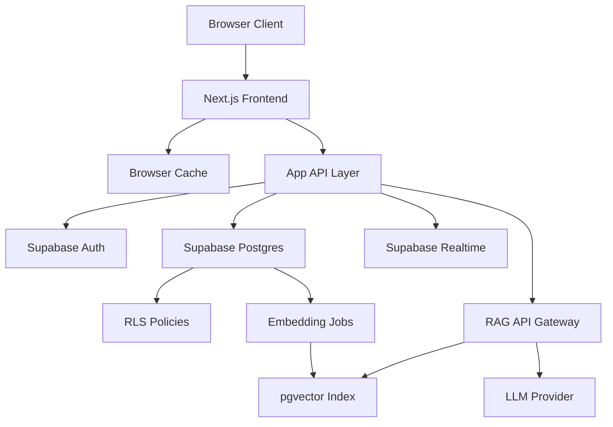
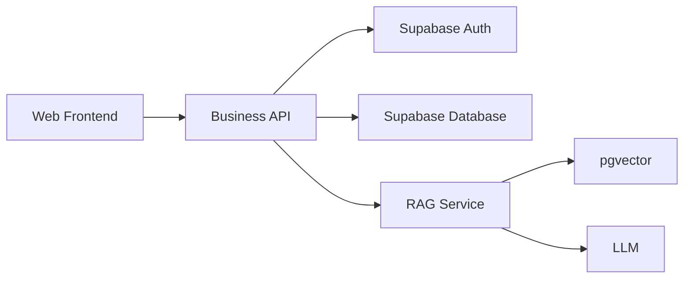

# SupaNoteGen Technical Design

Feature Name: supanotegen-original-requirement
Updated: 2026-07-04

## Description

本方案面向一个参考 NoteGen 前端体验、以浏览器作为主要交付形态、以 Supabase 作为云端能力中心的前后端分离产品。设计目标是把富文本编辑、树状知识组织、多用户隔离、群组共享、向量检索和对外 RAG API 组合为一套可渐进交付的 Web 系统。

## Recommended Positioning

### Product Shape

- SupaNoteGen 是一个浏览器优先的多用户知识库 SaaS。
- NoteGen 在本项目中作为前端体验参考对象，重点借鉴编辑器交互、树状导航、知识组织方式和内容创作流程。
- SupaNoteGen 的目标产物是独立 Web 应用，而不是 NoteGen 的桌面版搬运品。

### Reference Scope from NoteGen

- 参考范围：页面布局、双栏或三栏信息架构、笔记树交互、编辑器快捷操作、Markdown 与富文本混合体验。
- 自主设计范围：认证体系、多租户模型、协作共享、开放 API、向量检索、管理后台。
- 演进原则：视觉与交互可以吸收 NoteGen 优点，领域模型与后端架构按云产品标准重新设计。

## Recommended Technical Stack

### Frontend

- `Next.js` 负责 Web 页面、路由和 SSR 能力。
- `React` 负责编辑器、树状导航、共享界面和工作区状态。
- 编辑器能力建议优先评估 NoteGen 当前使用的编辑器方案，再决定复用同类编辑器内核还是仅复用交互设计。
- 浏览器本地缓存建议使用 `IndexedDB` 保存草稿、同步状态和最近访问数据。

### Backend

- 推荐采用独立 `Node.js API Service` 作为应用后端。
- 后端职责包括统一业务 API、服务端鉴权、群组共享规则编排、API Key 管理、RAG Gateway 和审计日志。
- 后端对 Supabase 承担 BFF 与业务中台角色，前端不直接暴露复杂业务规则。

### BaaS and AI

- `Supabase Auth` 负责身份认证和用户会话。
- `Supabase Postgres` 负责主业务数据。
- `Supabase RLS` 负责最终数据访问约束。
- `pgvector` 负责向量存储和相似度检索。
- `Edge Functions` 或 Worker 负责 embedding 异步任务。

### Recommendation Rationale

1. 浏览器 B/S 形态要求清晰的前后端边界，独立 API Service 更适合承载共享、开放接口和审计需求。
2. Supabase 适合承载认证、存储和权限底座，应用后端适合承载产品规则和外部接口治理。
3. NoteGen 的优势主要在前端体验层，复用交互思想比复用原有桌面实现更稳定。

## Architecture





### Architecture Decisions

1. 客户端采用三层分工：`Browser Client` 负责交互呈现，`Next.js Frontend` 负责页面与状态，`App API Layer` 负责服务端编排、鉴权和统一接口。
2. 云端采用 Supabase 原生能力：Auth 管理身份，Postgres 持久化结构化数据，RLS 实施强隔离，Edge Functions 或队列消费者处理向量化任务。
3. RAG 网关与业务 API 作为独立后端能力对外暴露，所有检索结果通过 `owner_user_id`、`group_id` 与 `access_scope` 进行过滤。
4. 设计优先支持单用户私有数据，再向群组共享平滑扩展，避免早期引入跨租户复杂度。

## System Boundaries

### Frontend Responsibilities

- 渲染知识库首页、树状目录、笔记详情、共享管理、API Key 管理页面。
- 管理编辑器状态、草稿状态、工作区切换和用户交互反馈。
- 调用统一业务 API，避免直接拼装复杂共享规则。

### Backend Responsibilities

- 暴露统一 REST API。
- 处理资源归属校验、共享关系校验、API Key 鉴权、审计日志、限流和 RAG 请求编排。
- 按服务端可信上下文访问 Supabase。

### Supabase Responsibilities

- 管理用户身份、会话和主数据存储。
- 通过 RLS 作为最终授权执行层。
- 提供 Realtime、向量查询和异步任务支撑能力。

## Deployment Topology

### Production Topology

- `Web Frontend`: 部署在 Vercel 或同类静态加 SSR 平台。
- `Business API`: 部署为独立 Node.js 服务，可运行在容器平台。
- `Supabase`: 承载数据库、认证、向量检索和边缘函数。
- `LLM Provider`: 外部模型服务，供 RAG 网关调用。

### Domain Design

- `app.supanotegen.com` 提供用户主站。
- `api.supanotegen.com` 提供业务 API 与开放接口。
- `api.supanotegen.com/api/v1/rag/chat` 提供对外 RAG 接口。

## Components and Interfaces

### 1. Browser Client

- 技术边界：浏览器负责页面渲染、编辑器交互、树结构导航和本地缓存。
- 本地能力：通过 IndexedDB 或 LocalStorage 暂存草稿、同步状态、最近访问数据。
- 约束：浏览器端不直接承担可信授权判断，最终权限由后端 API 和 Supabase RLS 共同执行。

### 2. Next.js Frontend

- 负责认证流程、页面路由、编辑器状态、树状目录 UI、共享管理 UI、API Key 管理 UI。
- 集成 `@supabase/supabase-js` 处理登录态和需要直连的受控数据访问。
- 维护客户端领域模型：`WorkspaceState`、`DraftState`、`SyncQueue`、`ConflictRecord`、`AccessContext`。

### 3. App API Layer

- 推荐实现：Next.js Route Handlers 或独立 Node.js API 服务。
- 负责封装前后端分离接口，包括知识库管理、群组共享、API Key 管理和 RAG Gateway。
- 对外提供统一 REST 接口，隐藏 Supabase 表结构和内部任务编排细节。

建议在正式方案中固定为独立 Node.js API 服务，理由如下：

- 对外开放接口和站内业务接口共享一套服务治理能力。
- 可独立扩展 API 并隔离前端构建发布节奏。
- 可在服务端集中接入限流、审计、监控与密钥管理。

### 4. SyncService

- 输入：编辑器保存事件、页面进入事件、认证状态变化、网络恢复事件。
- 输出：云端 Upsert/Delete、拉取结果合并、冲突记录、同步状态更新。
- 核心职责：
  - 为每条本地对象维护 `local_version`、`cloud_version`、`sync_status`、`last_synced_at`
  - 通过内容哈希和逻辑时间戳判断是否需要同步
  - 将删除操作表示为软删除墓碑，保证多端可收敛

### 5. Auth and Access Service

- 使用 Supabase Auth 的邮箱密码模式。
- 登录后在前端建立 `AccessContext`，包含 `user_id`、当前群组成员身份、可访问知识域集合。
- 所有数据库访问走已认证 Supabase Client，依赖数据库侧 RLS 执行最终授权。

### 6. Collaboration Service

- 负责群组创建、邀请、成员管理、共享绑定和权限校验。
- 共享对象粒度支持 `knowledge_base` 与 `folder` 两级。
- 权限模型采用 `read` 和 `write` 两档，保留未来扩展 `admin` 的数据结构空间。

### 7. Embedding Pipeline

- 触发点：笔记同步成功后写入 `embedding_jobs` 表，状态为 `pending`。
- 处理器：Supabase Edge Function 或外部 Worker 拉取待处理任务。
- 处理步骤：读取笔记正文、切分片段、生成 embedding、写入 `note_chunks` 与 `note_embeddings`。
- 幂等策略：按 `note_id + content_hash` 去重，重复任务只更新状态。

### 8. RAG API Gateway

- 推荐实现：独立应用后端中的 Route Handler 或网关服务暴露 `POST /api/v1/rag/chat`。
- 请求头：`Authorization: Bearer <api_key>`。
- 请求体：`question`、`knowledge_scope`、`top_k`、`conversation`。
- 处理流程：
  - 校验 API Key
  - 解析授权知识域
  - 生成查询向量
  - 按权限过滤执行相似度检索
  - 组装 prompt 并调用 LLM
  - 返回答案、引用与 tracing 信息

### 9. Shareable Knowledge API

- 面向站内协作：提供知识库、文件夹、笔记、群组、共享关系的内部业务接口。
- 面向外部集成：提供知识域级别的查询和问答接口，首期以 RAG API 为主。
- 对外开放策略：先开放只读检索与问答接口，再评估开放写入型知识导入接口。

## Data Models

### Core Tables

```text
users
  id uuid pk
  email text
  created_at timestamptz

user_profiles
  user_id uuid pk references users.id
  display_name text
  default_workspace_id uuid null

knowledge_bases
  id uuid pk
  owner_user_id uuid references users.id
  name text
  description text
  created_at timestamptz
  updated_at timestamptz
  deleted_at timestamptz null

folders
  id uuid pk
  owner_user_id uuid references users.id
  knowledge_base_id uuid references knowledge_bases.id
  parent_folder_id uuid null references folders.id
  title text
  sort_key text
  created_at timestamptz
  updated_at timestamptz
  deleted_at timestamptz null

notes
  id uuid pk
  owner_user_id uuid references users.id
  knowledge_base_id uuid references knowledge_bases.id
  folder_id uuid null references folders.id
  title text
  markdown_content text
  content_hash text
  local_source_path text
  version bigint
  created_at timestamptz
  updated_at timestamptz
  deleted_at timestamptz null
```

### Collaboration Tables

```text
groups
  id uuid pk
  owner_user_id uuid references users.id
  name text
  created_at timestamptz

group_invitations
  id uuid pk
  group_id uuid references groups.id
  inviter_user_id uuid references users.id
  invitee_email text
  status text
  expires_at timestamptz

group_members
  id uuid pk
  group_id uuid references groups.id
  user_id uuid references users.id
  role text
  joined_at timestamptz

resource_shares
  id uuid pk
  resource_type text
  resource_id uuid
  group_id uuid references groups.id
  permission text
  created_by uuid references users.id
  created_at timestamptz
```

### Sync and AI Tables

```text
sync_events
  id uuid pk
  owner_user_id uuid references users.id
  resource_type text
  resource_id uuid
  operation text
  local_version bigint
  cloud_version bigint null
  status text
  payload jsonb
  created_at timestamptz

embedding_jobs
  id uuid pk
  note_id uuid references notes.id
  owner_user_id uuid references users.id
  content_hash text
  status text
  error_message text null
  created_at timestamptz
  updated_at timestamptz

note_chunks
  id uuid pk
  note_id uuid references notes.id
  owner_user_id uuid references users.id
  share_scope jsonb
  chunk_index integer
  chunk_text text
  content_hash text

note_embeddings
  chunk_id uuid pk references note_chunks.id
  owner_user_id uuid references users.id
  embedding vector(1536)
  created_at timestamptz

api_keys
  id uuid pk
  owner_user_id uuid references users.id
  key_hash text
  scope_type text
  scope_id uuid null
  status text
  last_used_at timestamptz null
  created_at timestamptz
  revoked_at timestamptz null
```

## Authorization Model

### Private Resource Rule

- 私有资源表 `knowledge_bases`、`folders`、`notes`、`sync_events`、`embedding_jobs` 默认通过 `owner_user_id = auth.uid()` 控制访问。
- 所有相关表启用 `enable row level security`，并对高价值表追加 `force row level security`。

### Shared Resource Rule

- 共享访问通过 `resource_shares` 与 `group_members` 联结判断。
- 读取条件：当前用户是资源所有者，或当前用户属于被授予共享权限的群组成员。
- 写入条件：当前用户是资源所有者，或当前用户属于被授予 `write` 权限的群组成员。

### RAG Access Rule

- RAG 检索只查询调用方可访问范围内的 `note_chunks`。
- API Key 绑定到用户私域或指定群组域，服务端先把 API Key 映射为 `AccessContext`，再执行检索 SQL。
- 向量表保留 `owner_user_id` 和 `share_scope` 字段，保证过滤条件与笔记主表一致。

## Sync Strategy

### Local Metadata

浏览器缓存为每个对象维护如下元数据：

```ts
type SyncMetadata = {
  resourceId: string
  resourceType: 'knowledge_base' | 'folder' | 'note'
  localVersion: number
  cloudVersion: number | null
  syncStatus: 'synced' | 'pending' | 'conflict' | 'failed'
  contentHash: string
  lastSyncedAt: string | null
  tombstone: boolean
}
```

### Event Flow

1. 编辑器保存时，前端先更新浏览器缓存与页面状态。
2. 页面状态管理把变更交给 `SyncService.enqueue`。
3. `SyncService` 通过应用后端接口提交幂等 upsert 请求。
4. 云端写入成功后，创建 `embedding_jobs` 记录。
5. Realtime、页面切换或重新进入工作区时，客户端执行增量拉取与合并。

### Conflict Resolution

- 第一阶段采用 `version + content_hash` 的乐观并发模型。
- 同步提交时若云端版本大于本地已知版本，系统创建 `ConflictRecord`。
- 冲突展示规则：保留本地内容副本、保留云端版本、引导用户选择覆盖或合并。
- V0.1 到 V0.2 允许采用“用户手动决议”策略，V0.3 以后可扩展字段级合并。

## API Design

### API Classification

- `User API`: 面向浏览器前端，处理登录态用户的日常操作。
- `Collaboration API`: 面向群组与共享管理。
- `Developer API`: 面向第三方应用，处理 API Key 鉴权与对外访问。

### Auth Endpoints

- `POST /auth/sign-up`
- `POST /auth/sign-in`
- `POST /auth/sign-out`
- `GET /auth/session`

### Collaboration Endpoints

- `POST /api/v1/groups`
- `POST /api/v1/groups/{groupId}/invitations`
- `POST /api/v1/groups/invitations/{invitationId}/accept`
- `POST /api/v1/shares`
- `PATCH /api/v1/shares/{shareId}`

### Knowledge Base Endpoints

- `GET /api/v1/knowledge-bases`
- `POST /api/v1/knowledge-bases`
- `GET /api/v1/knowledge-bases/{knowledgeBaseId}`
- `PATCH /api/v1/knowledge-bases/{knowledgeBaseId}`
- `GET /api/v1/folders/{folderId}/notes`
- `POST /api/v1/notes`
- `PATCH /api/v1/notes/{noteId}`

### Developer Endpoints

- `POST /api/v1/developer/api-keys`
- `GET /api/v1/developer/api-keys`
- `POST /api/v1/developer/api-keys/{apiKeyId}/revoke`
- `POST /api/v1/rag/chat`

### RAG Endpoint

```json
POST /api/v1/rag/chat
{
  "question": "如何接入 Supabase 同步?",
  "knowledge_scope": {
    "type": "user",
    "id": "user-or-group-id"
  },
  "top_k": 6,
  "conversation": []
}
```

响应示例：

```json
{
  "answer": "...",
  "citations": [
    {
      "note_id": "uuid",
      "chunk_id": "uuid",
      "score": 0.91,
      "excerpt": "..."
    }
  ],
  "request_id": "uuid"
}
```

## Correctness Properties

1. 任意私有资源的读写结果都必须满足 `owner_user_id` 或共享授权关系约束。
2. 任意共享写入必须满足群组成员身份和 `write` 权限同时成立。
3. 同一 `note_id + content_hash` 在任一时刻最多存在一个有效向量化任务结果。
4. 任意 RAG 检索结果都必须来自调用方授权范围内的笔记片段。
5. 离线编辑结果在网络恢复后必须进入可观测的同步状态机，直到达到 `synced`、`conflict` 或 `failed` 终态。

## Error Handling

### Authentication Errors

- 登录失败：前端提示认证失败原因并保留本地工作区入口。
- 会话过期：前端刷新会话，失败后转入只读离线模式。

### Sync Errors

- 网络错误：标记 `pending` 并指数退避重试。
- RLS 拒绝：标记 `failed`，提示权限异常并输出审计日志。
- 冲突错误：标记 `conflict` 并生成可视化冲突项。

### Embedding Errors

- 模型调用失败：`embedding_jobs.status = failed`，支持重试。
- 笔记已删除：任务进入 `skipped`，清理旧 chunk 与 embedding。

### RAG Errors

- API Key 无效：返回 `401`。
- 授权范围为空：返回 `403`。
- 检索结果为空：返回空引用与可解释回答。
- LLM 超时：返回 `502` 并附带 `request_id`。

## Delivery Plan

### V0.1 Local Sync Foundation

- 建立前端项目、独立 API 服务、Supabase 项目和基础表结构。
- 完成知识库、文件夹、笔记的基础 CRUD。
- 完成浏览器缓存、草稿保存和基础 upsert/pull 闭环。

### V0.2 Auth and Isolation

- 接入邮箱密码注册登录。
- 完成 `owner_user_id` 全链路绑定与 RLS 强隔离。
- 增加会话恢复、离线模式与权限失败提示。

### V0.3 Groups and Sharing

- 上线群组、邀请、成员管理、资源共享。
- 扩展共享 RLS 策略与读写权限控制。
- 为共享资源同步与检索加入 `share_scope`。

### V0.4 RAG Platform

- 上线向量化任务链路、`pgvector` 索引和 RAG API。
- 增加 API Key 管理、调用审计与基础限流。
- 验证外部应用基于指定知识域可稳定问答。

## Suggested Implementation Order

1. 先做浏览器版知识库基础体验，完成知识库树、笔记编辑器、基础 CRUD。
2. 再接入多用户 Auth 和 `owner_user_id` 隔离，确保单用户闭环完整。
3. 然后实现群组共享和知识库授权，稳定协作模型。
4. 最后接入向量化与对外 RAG API，形成开放平台能力。

## Test Strategy

1. 数据库层：为每张核心表编写 RLS 集成测试，覆盖私有访问、共享访问、越权访问。
2. 客户端层：为 `SyncService` 编写单元测试，覆盖新增、更新、删除、离线恢复、冲突处理。
3. API 层：为 Auth、Groups、Shares、RAG API 编写端到端测试。
4. AI 层：对向量化任务和检索流程编写契约测试，验证权限过滤与引用返回。
5. 前端层：验证浏览器缓存、编辑器草稿恢复和弱网状态下的交互连续性。

## References

[^1]: Supabase 官方文档中关于 RLS、Auth、Edge Functions 和受权限约束 RAG 的能力说明。
[^2]: NoteGen 作为前端体验参考对象，重点借鉴编辑器交互和树状信息架构，而非桌面壳层实现。
[^3]: `/workspace/README` 中记录的 SupaNoteGen 原始需求摘要。
